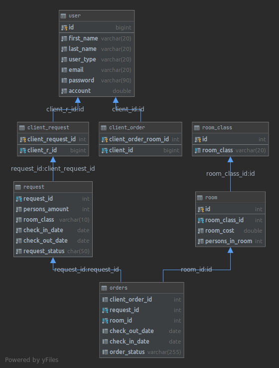

## Java Web Development course from EPAM - final task (implementation on SPRING Framework)

### Base Task description:

System **Hotel booking**. 
- **The client** fills in the **Application** and send **Request**, indicating the number of beds in the room, the class of apartments
and the time of stay. 
- **The administrator** reviews the received **Request**, selects the most suitable available
**Room(s)**, 
- after which the system exposes **Invoice to the Client**.

### In Addition To A Base Task:
- an admin may reject a client's request
- a client can pay an invoice which sending by admin after the request approving
- a client has a balance of money that can be top-up

### Resources

- factory/command.json - contains items of the commands factory
- factory/menu.json - contains items of the menu factory
- factory/services - contains items of the services factory
- local/local_by_BY.properties - contains the localization texts to English language
- local/local_en_US.properties - contains the localization texts to Belarusian language
- sql/script.sql - contains SQL statements to create the tables, stored procedures of the database for the current project and insert init data for some tables.
- application.properties - contains the settings of spring, database.
        
#### Technologies:

- Java (JDK 11)
- maven (build tool)
- spring-boot-starter-parent 2.6.1
- spring-boot-starter-tomcat 2.6.1
- spring-boot-starter-data-jpa 2.6.1
- spring-boot-starter-security 2.6.1
- spring-boot-starter-validation 2.6.1
- spring-boot-starter-test 2.6.1
- tomcat-embed-jasper
- jstl
- jsp-api
- lombok
- junit

#### Database schema:

